# local-llm-mcp

<p align="center">
  
</p>

<p align="center">
  <a href="https://github.com/NAJEMWEHBE/local-llm-mcp/releases/latest"></a>
  <a href="LICENSE"></a>
  <a href="https://www.python.org/downloads/"></a>
  <a href="https://modelcontextprotocol.io"></a>
  <a href="https://glama.ai/mcp/servers/NAJEMWEHBE/local-llm-mcp"></a>
  <a href="https://github.com/NAJEMWEHBE/local-llm-mcp/releases/latest"></a>
  <a href="https://claude.ai/code"></a>
  <a href="https://github.com/NAJEMWEHBE/local-llm-mcp/stargazers"></a>
</p>

MCP server that exposes locally-hosted OSS LLMs (Ollama, LM Studio, vLLM, any OpenAI-compatible runtime) as tools for Claude Code, Claude Desktop, and Codex CLI.

Pairs with cloud-model MCPs like [nvidia-models-mcp](https://github.com/NAJEMWEHBE/nvidia-models-mcp) for tiered workflows: small/fast local models for high-frequency mechanical tasks, big cloud models for heavy reasoning.

## Tools

| Tool | Purpose |
|------|---------|
| `list_models` | Fetches the live model inventory from the runtime (`/api/tags`). |
| `local_chat` | Single-model completion. Args: `model`, `prompt`, optional `system`, `max_tokens`, `temperature`. |
| `local_compare` | Ensemble fan-out: runs the same prompt across multiple local models and returns labeled outputs. Defaults to the smallest three installed models. |

## Requirements

- Python 3.10+
- [`uv`](https://docs.astral.sh/uv/) (fast Python package manager)
- A local OpenAI-compatible runtime running. Tested with:
  - [Ollama](https://ollama.com) — default `http://127.0.0.1:11434`
  - [LM Studio](https://lmstudio.ai) — default `http://127.0.0.1:1234` (set `OLLAMA_HOST` accordingly)
  - vLLM, llama.cpp server, text-generation-webui — any runtime exposing `/v1/chat/completions` and `/api/tags`

## Install

### Claude Desktop (DXT one-click)

1. Download the latest `local-llm.dxt` from [Releases](https://github.com/NAJEMWEHBE/local-llm-mcp/releases).
2. Drag-drop into Claude Desktop → Settings → Extensions.
3. Restart Claude Desktop.

### Claude Code (manual)

Add to `~/.claude.json` (top level):

```json
{
  "mcpServers": {
    "local-llm": {
      "command": "uv",
      "args": [
        "--directory",
        "/absolute/path/to/local-llm-mcp",
        "run",
        "server.py"
      ],
      "env": {
        "LOCAL_LLM_HOST": "http://127.0.0.1:11434"
      }
    }
  }
}
```

Restart Claude Code. Tools appear as `mcp__local-llm__list_models`, `mcp__local-llm__local_chat`, `mcp__local-llm__local_compare`.

### Codex CLI

Add to `~/.codex/config.toml`:

```toml
[mcp_servers.local-llm]
command = "uv"
args = ["--directory", "/absolute/path/to/local-llm-mcp", "run", "server.py"]
env = { LOCAL_LLM_HOST = "http://127.0.0.1:11434" }
```

## Configuration

The host URL is resolved in this order (first set wins):

| Priority | Env var | Notes |
|---------|---------|-------|
| 1 | `LOCAL_LLM_HOST` | Preferred. Runtime-agnostic name. |
| 2 | `OPENAI_BASE_URL` | Common in OpenAI-SDK ecosystems. |
| 3 | `OLLAMA_HOST` | Legacy / Ollama-default. Kept for backward compatibility. |
| 4 | `http://127.0.0.1:11434` | Built-in fallback (Ollama default port). |

Examples:
- Ollama: `LOCAL_LLM_HOST=http://127.0.0.1:11434` (or just leave unset)
- LM Studio: `LOCAL_LLM_HOST=http://127.0.0.1:1234`
- vLLM: `LOCAL_LLM_HOST=http://127.0.0.1:8000`
- Remote box on LAN: `LOCAL_LLM_HOST=http://192.168.1.50:11434`

The server hits two endpoints on the host: `GET /api/tags` (model inventory) and `POST /v1/chat/completions` (inference). Any runtime exposing both works.

### Request timeout

Large local models (27B+ params) can take several minutes to cold-load into VRAM the first time they're called. The per-request timeout defaults to **300 seconds** and can be raised or lowered via `LOCAL_LLM_TIMEOUT` (seconds, float).

| Env var | Default | Notes |
|---------|---------|-------|
| `LOCAL_LLM_TIMEOUT` | `300.0` | Per-call timeout for `local_chat` / `local_compare`. Bad values (empty, non-numeric, zero, negative, inf/nan) silently fall back to the default. |

SDK auto-retries are disabled (`max_retries=0`) because cold-load failures are deterministic, not transient — silent retries would multiply wall-clock with no benefit.

## Smoke test

```bash
cd /path/to/local-llm-mcp
uv sync
uv run python -c "from server import list_models; print(list_models())"
```

The first run pulls dependencies into `.venv`. Subsequent runs reuse them.

## Multi-Agent Leader recipe (Claude + local + cloud)

This MCP shines when paired with a cloud-model MCP (e.g. [nvidia-models-mcp](https://github.com/NAJEMWEHBE/nvidia-models-mcp)) and a global `CLAUDE.md` that turns Claude into the orchestrator. Total token win: ~300–500 saved per session by not retyping the multi-agent reminder, plus offloaded bulk work to local hardware.

### 1. Wire both MCPs

`~/.claude.json` (Claude Code):

```json
{
  "mcpServers": {
    "local-llm": {
      "command": "uv",
      "args": ["--directory", "/path/to/local-llm-mcp", "run", "server.py"],
      "env": { "LOCAL_LLM_HOST": "http://127.0.0.1:11434" }
    },
    "nvidia-models": {
      "command": "uv",
      "args": ["--directory", "/path/to/nvidia-models-mcp", "run", "server.py"],
      "env": { "NVIDIA_API_KEY": "nvapi-..." }
    }
  }
}
```

### 2. Add a tiny global directive — `~/.claude/CLAUDE.md`

```markdown
# Multi-agent leader

You lead a multi-agent crew. For heavy/bulk work or second opinions, delegate.

Workers:
- Local (Ollama): qwen3:27b (code), gemma3:8b (prose/review) via
  `mcp__local-llm__local_chat` and `local_compare`.
- Cloud (NIM): Qwen, Llama, DeepSeek, Mixtral via
  `mcp__nvidia-models__nvidia_chat` and `nvidia_compare`.

Never paste worker output blindly — verify against the spec.
Architecture and security-sensitive work stays with Claude.
If local is down, fall back to cloud; never silently solo.
```

### 3. (Optional) Add a Multi-Agent Leader skill

Drop a `~/.claude/skills/multi-agent-leader/SKILL.md` with role split, delegate triggers, and verification rules so the protocol auto-loads only when relevant. Example trigger description:

> Use when the task involves heavy code generation, bulk transforms, doc drafting, verification passes, or the user mentions "multi-agent", "delegate", "use Qwen", "use Gemma", "ensemble", or "second opinion".

### Example flow

> **User:** Generate Pydantic models for these 12 JSON schemas.
>
> **Claude:** Delegating bulk generation to `qwen3:27b` (local). Verifying types after.
>
> [Calls `mcp__local-llm__local_chat(model="qwen3:27b", prompt="<schemas+spec>", temperature=0.2)`]
>
> **Claude:** Qwen wrote 12 models. Diffed against schemas — one missing `Optional[int]` repaired. Wrote `models.py`.

### When to delegate (skill rubric)

| Task | Route |
|------|-------|
| Code block > ~200 lines | `local_chat(qwen3:27b)` |
| Bulk repetitive transform (rename, port, generate N tests) | `local_chat(qwen3:27b)` |
| Doc / docstring / README draft | `local_chat(gemma3:8b)` |
| Review pass on Claude's output | `nvidia_chat(qwen-coder)` for second opinion |
| Hard decision (algorithm, API, tricky bug) | `local_compare` or `nvidia_compare` for fan-out |
| Architecture decision | Claude only |
| Auth / crypto / payment code | Claude only |
| Ambiguous spec | Claude clarifies with user first |

### Verification pattern (mandatory)

1. Read worker output.
2. Diff against the spec / user intent.
3. Check: drift, hallucinated APIs, wrong style, missing edge cases (null, zero, empty, error paths), incorrect imports.
4. Repair, escalate, or re-prompt before writing to disk.
5. Never blind-paste.

## Building a DXT release

```bash
cd /path/to/local-llm-mcp
python -c "import zipfile, pathlib; src=pathlib.Path('.'); out=pathlib.Path('local-llm.dxt'); files=['manifest.json','server.py','pyproject.toml','README.md']; z=zipfile.ZipFile(out,'w',zipfile.ZIP_DEFLATED); [z.write(src/f,arcname=f) for f in files]; z.close(); print(out.stat().st_size,'bytes')"
```

## License

MIT — see [LICENSE](LICENSE).
